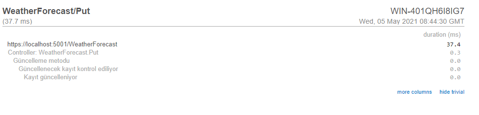
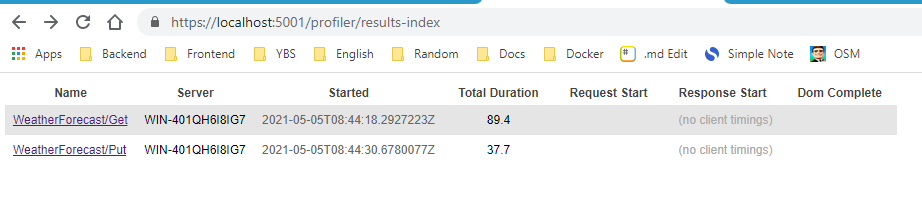
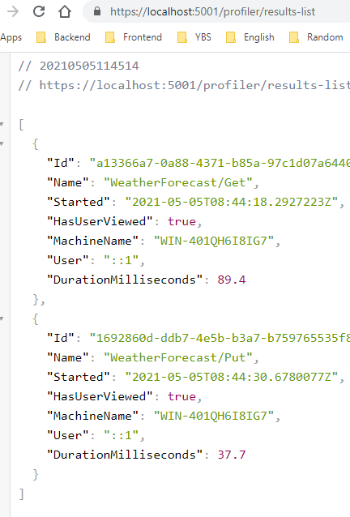
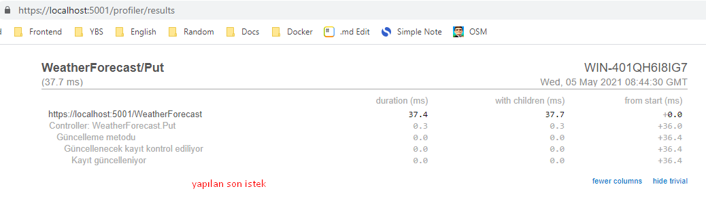

# Mini Profiler 
Mevcut yapıdaki tüm yapılanmanın detayını görmemizi sağlamakta ve olası 
sorunları hızlıca belirleyip, gidermemize imkan tanımaktadır.

> dotnet add package MiniProfiler.AspNetCore.Mvc --version 4.1.0

> dotnet add package MiniProfiler.EntityFrameworkCore --version 4.1.0

````
services.AddMemoryCache();

services.AddMiniProfiler(op =>
{
    op.RouteBasePath = "/profiller";

    //60 dakikada bir depolama kontrol edilecektir.
    //Varsayılan değeri 30 dakikadır.                
    (op.Storage as MemoryCacheStorage).CacheDuration = TimeSpan.FromMinutes(60);

    //SQL formatlayıcısı kontrol edilmektedir.
    //Varsayılan olarak InlineFormatter'dir.
    op.SqlFormatter = new StackExchange.Profiling.SqlFormatters.InlineFormatter();

    //SQL formatlayıcısı kontrol edilmektedir.
    //Varsayılan olarak InlineFormatter'dir.
    op.TrackConnectionOpenClose = true;
}).AddEntityFramework();
````

````
>app.UseMiniProfiller();
````

### controller'da anlık kontrol etme
````
[HttpPut]
public IActionResult Put(PersonModel model)
{
    using (MiniProfiler.Current.Step("Güncelleme metodu"))
    {
        bool hasData = false;
        using (MiniProfiler.Current.Step("Güncellenecek kayıt kontrol ediliyor"))
        {
            hasData = true;
            if (hasData)
            {
                using (MiniProfiler.Current.Step("Kayıt güncelleniyor"))
                {
                    model = new PersonModel()
                    {
                        Id = 1,
                        Name = "Can",
                        Surname = "Canbolat"
                    };
                }
            }
        }
    }

    return Ok(model);
}
````


uygulamaya yapılan tüm isteklere **/profiler/results-index**'den
son isteğe **/profiler/results**'dan
tüm isteklerin json haline **/profiler/results-list**'den erişilebilir.

## Results



